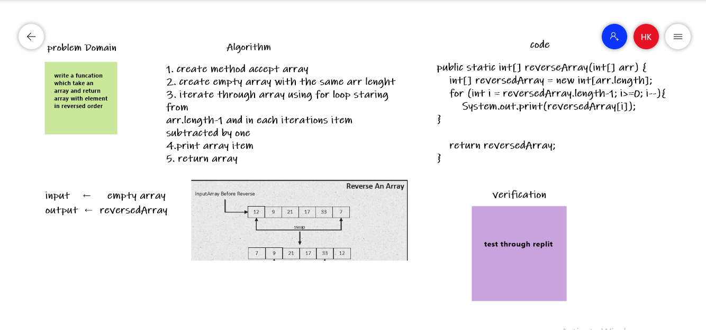

## Reverse an Array 

### code:

public static int[] reverseArray(int[] arr) {
    int[] reversedArray = new int[arr.length];
    for (int i = reversedArray.length-1; i>=0; i--){
        System.out.print(reversedArray[i]);
}

 return reversedArray;
 
}
