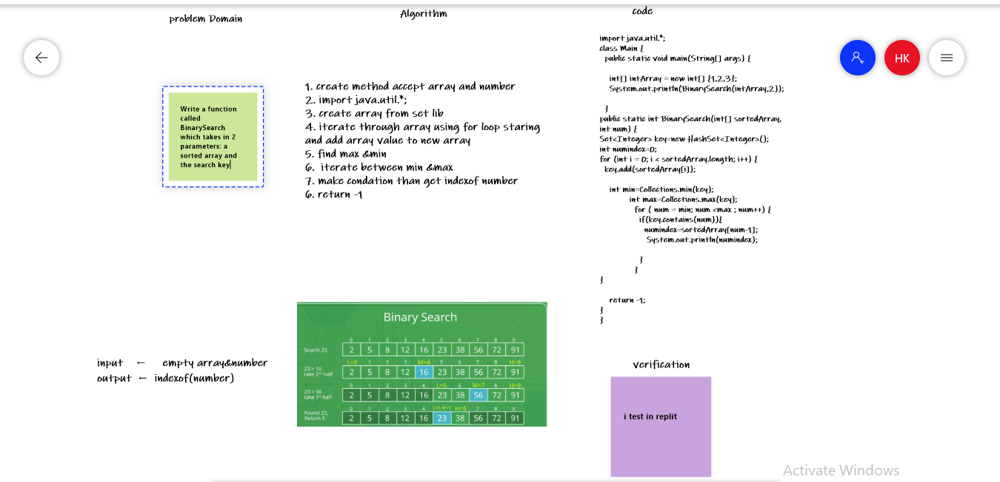

## BinarySearch 

### code:

public static int[] insertShiftArray(int[] arr, int num) {
 int[] newArr = new int[arr.length + 1];
    int numIdex = (int) Math.ceil((arr.length + 1) / 2);

  for(int i = 0; i < newArr.length; i++){
   if(i<index){
     newArr[i]=insertShiftArray[i]
   }
 else if (i=index){
     newArr[i]=num
   }
   else if (i>index){
     newArr[i]=insertShiftArray[i-1]
   }
   }
  
return newArr;
}