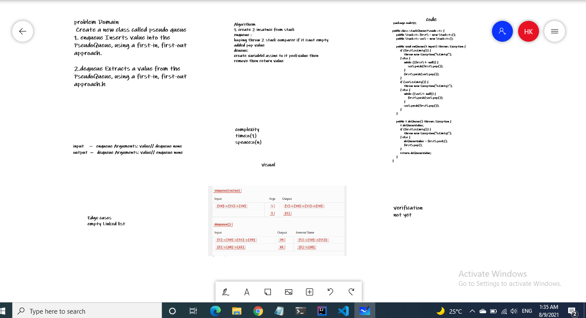

### Code Challenge: Class 11
Feature Tasks
1. Create a new class called pseudo queue.
Do not use an existing Queue.
Instead, this PseudoQueue class will implement our standard queue interface (the two methods listed below),
Internally, utilize 2 Stack instances to create and manage the queue
### Methods:
1. enqueue
Arguments: value
Inserts value into the PseudoQueue, using a first-in, first-out approach.
2. dequeue
Arguments: none
Extracts a value from the PseudoQueue, using a first-in, first-out approach.h
