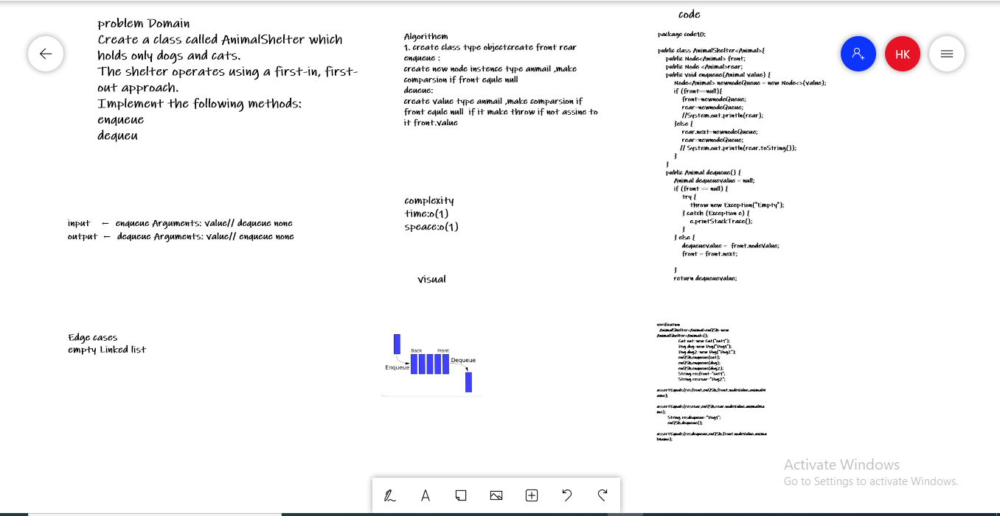

### Code Challenge: Class 12
Feature Tasks
1. Create a class called AnimalShelter which holds only dogs and cats.
The shelter operates using a first-in, first-out approach.
### Implement the following methods:
1. enqueue
Arguments: animal
animal can be either a dog or a cat object.
2. dequeue
Arguments: pref
pref can be either "dog" or "cat"
Return: either a dog or a cat, based on preference.
If pref is not "dog" or "cat" then return null.
