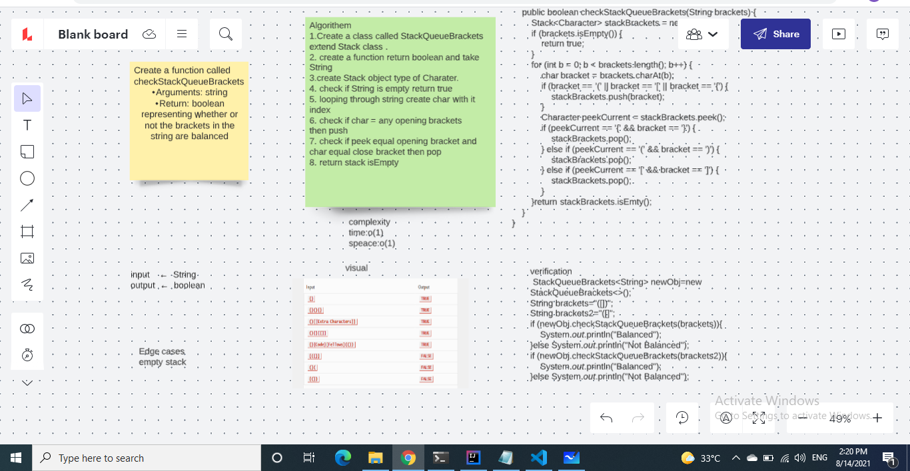

### Code Challenge: Class 13
Feature Tasks
1.Write a function called validate brackets
- Arguments: string
- Return: boolean

### Implement the following method:
Create function called validate brackets
- representing whether or not the brackets in the string are balanced
