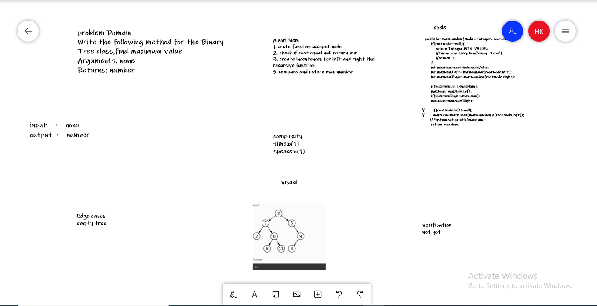

## Max Tree 

### code:
`` public int maxNumber(Node <Integer> rootNode) {
        if(rootNode==null){
            return Integer.MIN_VALUE;
        }
        int maxNum=rootNode.nodeValue;
        int maxNumLeft= maxNumber(rootNode.left);
        int maxNumRight=maxNumber(rootNode.right);
        if(maxNumLeft>maxNum);
        maxNum=maxNumLeft;
        if(maxNumRight>maxNum);
        maxNum=maxNumRight;
       // System.out.println(maxNum);
        return maxNum;
}``
