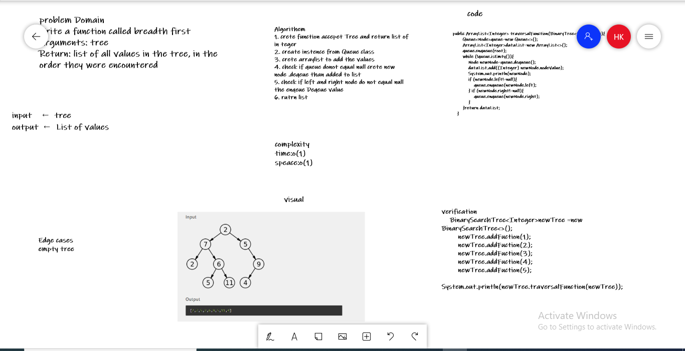

## tree-breadth-first 

### code:
``public ArrayList<Integer> traversalFunction(BinaryTree<t> newTree){
        Queue<Node>queue=new Queue<>();
        ArrayList<Integer>dataList=new ArrayList<>();
        queue.enqueue(root);
        while (!queue.isEmty()){
            Node newNode=queue.dequeue();
            dataList.add((Integer) newNode.nodeValue);
            System.out.println(newNode);
            if (newNode.left!=null){
                queue.enqueue(newNode.left);
            } if (newNode.right!=null){
                queue.enqueue(newNode.right);
            }
        }return dataList;
    }``