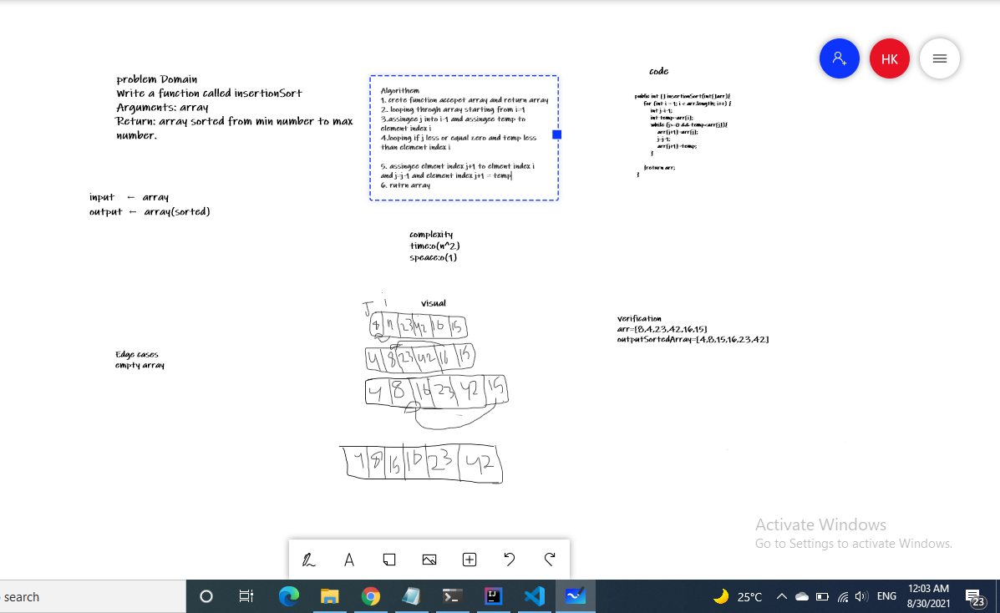

 # Challenge Summary
Write a function called insertionSort
Arguments: array
Return: array sorted from min number to max number.
## Whiteboard Process


## Approach & Efficiency
complexity
time:o(n^2)
speace:o(1)
## Solution
```
   public int [] insertionSort(int[]arr){
        for (int i = 1; i < arr.length; i++) {
            int j=i-1;
            int temp=arr[i];
            while (j>=0 && temp<arr[j]){
                arr[j+1]=arr[j];
                j=j-1;
                arr[j+1]=temp;
            }
            
        }return arr;
    }
```