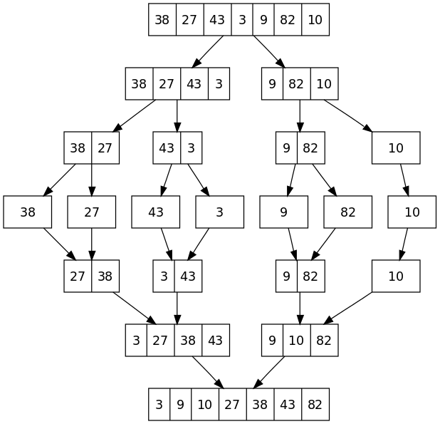

## code27Blog
### merge sort 
- Sorting by divding array in each time in tow parts

 ### Steps:
 1. divid array into tow parts left and right.

 2. divid each part into tow part.
 3. keep dividing until each part has one element 
 4. comparing if leftelement is less or equal  rightelemnt 
 then assingee min element to current.
 5. if left is empty,then set remaining entries in arr to remaining values in right
 6. if right is empty,then set remaining entries in arr to remaining values in left
  7. merge sort array  [3,9,10,27,28,43,82]