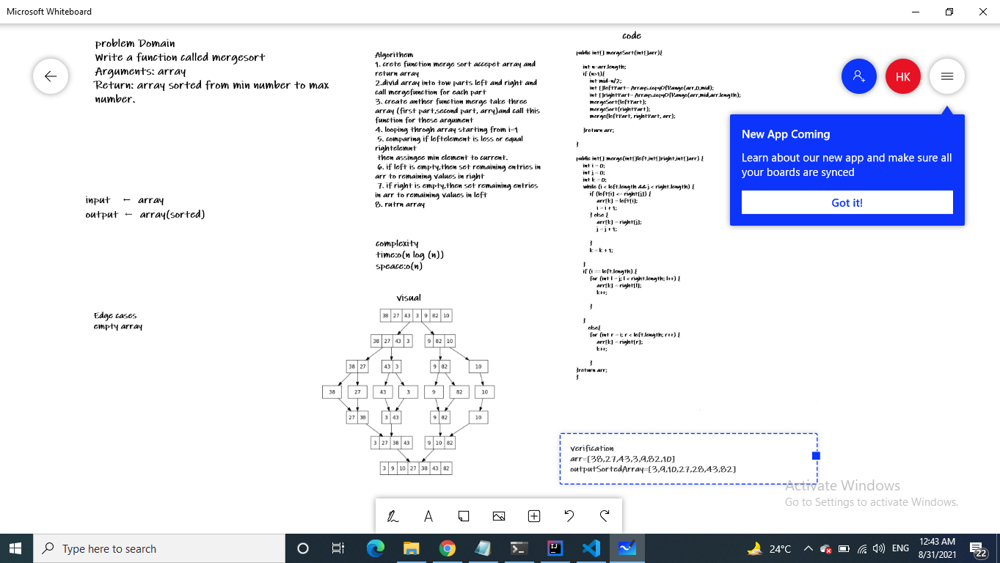

 # Challenge Summary
Write a function called MergeSort
Arguments: array
Return: array sorted from min number to max number.
## Whiteboard Process


## blogLink
|Merge-Sort-blog|[link](blog27.md)|


## Approach & Efficiency
complexity
time:O(n log n)
speace:O(n)
## Solution
```
      public int[] mergeSort(int[]arr){

        int n=arr.length;
//        int[] arrayList= new int[n];
        if (n>1){
            int mid=n/2;
            //https://wwint []leftPartw.codegrepper.com/code-examples/java/split+array+in+java//from this url know how split array by using Arrays.copyOfRange
            int []leftPart= Arrays.copyOfRange(arr,0,mid);
            int []rightPart= Arrays.copyOfRange(arr,mid,arr.length);
            mergeSort(leftPart);
            mergeSort(rightPart);
            merge(leftPart, rightPart, arr);

        }return arr;

    }

    public int[] merge(int[]left,int[]right,int[]arr) {
        int i = 0;
        int j = 0;
        int k = 0;
        while (i < left.length && j < right.length) {
            if (left[i] <= right[j]) {
                arr[k] = left[i];
                i = i + 1;
            } else {
                arr[k] = right[j];
                j = j + 1;

            }
            k = k + 1;

        }
        if (i == left.length) {
            //left part empty
            //       set remaining entries in arr to remaining values in right
            for (int l = j; l < right.length; l++) {
                arr[k] = right[l];
                k++;
                
            }

        }
           else{
               //right is empty
        //       set remaining entries in arr to remaining values in left
            for (int r = i; r < left.length; r++) {
                arr[k] = right[r];
                k++;

            }
    }return arr;
    }
```