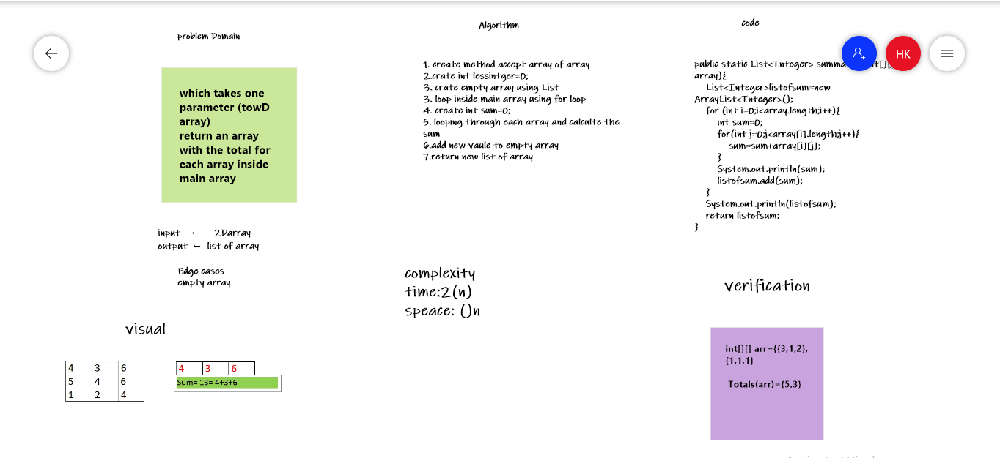

## 2D array 

### code:
 ``public static List<Integer> summation(int[][] array){
    List<Integer>listofsum=new ArrayList<Integer>();
    for (int i=0;i<array.length;i++){
        int sum=0;
    for(int j=0;j<array[i].length;j++){
        sum=sum+array[i][j];
        }
        System.out.println(sum);
        listofsum.add(sum);
    }
    System.out.println(listofsum);
    return listofsum;
}``
