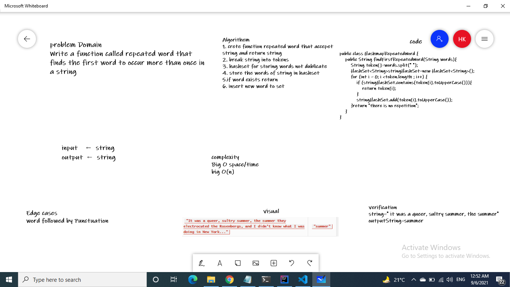

 # Challenge Summary

Write a function called repeated word that finds the first word to occur more than once in a string
## Whiteboard Process


## Approach & Efficiency
complexity
Big O space/time
big O(n)
## Solution
```
 public class HashmapRepeatedWord {
    public String findFirstRepeatedWord(String words){
        String token[]=words.split(" ");
        HashSet<String>stringHashSet=new HashSet<String>();
        for (int i = 0; i <token.length ; i++) {
            if (stringHashSet.contains(token[i].toUpperCase())){
                return token[i];
            }
            stringHashSet.add(token[i].toUpperCase());
        }return "there is no repetition";
    }
}
```
