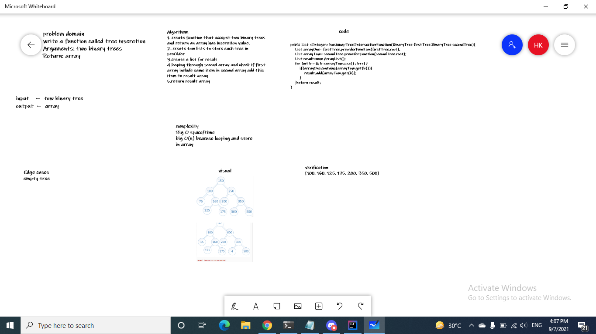

 # Challenge Summary

Write a function called tree intersection
Arguments: two binary trees
Return: array
## Whiteboard Process



## Approach & Efficiency
complexity
Big O space/time
big O(n) beacuse looping and store in array
## Solution
```
 public List <Integer> hashmapTreeIntersectionFunction(BinaryTree firstTree,BinaryTree secondTree){
    List arrayOne= firstTree.preorderFunction(firstTree.root);
    List arrayTow= secondTree.preorderFunction(secondTree.root);
    List result=new ArrayList();
    for (int b = 0; b <arrayTow.size() ; b++) {
        if(arrayOne.contains(arrayTow.get(b))){
            result.add(arrayTow.get(b));
        }
    }return result;
}
```
