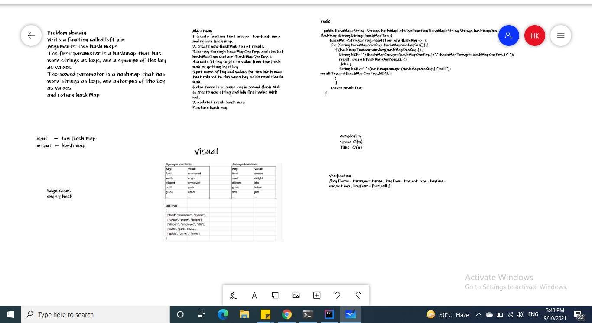

# Hashmap LEFT JOIN

LEFT JOIN means all the values in the first hashmap are returned, and if values exist in the “right” hashmap, they are appended to the result row.

## Challenge

Write a function called left join
Arguments: two hash maps
The first parameter is a hashmap that has word strings as keys, and a synonym of the key as values.
The second parameter is a hashmap that has word strings as keys, and antonyms of the key as values.
and return hashMap

## Approach & Efficiency

space O(n) because use hashMab result to store.
time  O(n) because we loobing

## Solution
