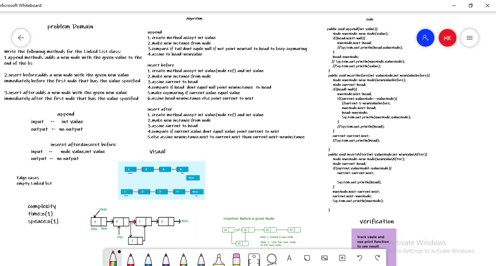

# Challenge Summary
Write the following methods for the Linked List class:

1. append add value at last node
arguments: new value
adds a new node with the given value to the end of the list
2. insert before :add value before node
arguments: value, new value
adds a new node with the given new value immediately before the first node that has the value specified
3. insert after :add value after node
arguments: value, new value
adds a new node with the given new value immediately after the first node that has the value specified

## Whiteboard Process

## Approach & Efficiency
Big O:
* time :o(1)
* speace:o(1)

## Solution
   public void append(int value){
        Node nweNode=new Node(value);
        if(head.next!=null){
            nweNode.next=head;
            //System.out.println(head.valueNode);
        }
        head=nweNode;
       // System.out.println(nweNode.valueNode);
        //System.out.println(value);
    }
    public void insertbefore(int valueNode,int newValuebefore){
        Node nweNode=new Node(newValuebefore);
        Node current=head;
        if(head!=null){
            nweNode.next=head;
            if(current.valueNode==valueNode){
                //current-1=newValuebefore;
                nweNode.next=head;
                head=nweNode;
                System.out.println(nweNode.valueNode);
            }
            //System.out.println(head);
        }
        current=current.next;
        //System.out.println(head);

    }
    public void insertAfter(int valueNode,int newValueAfter){
        Node nweNode=new Node(newValueAfter);
        Node current=head;
        if(current.valueNode!=valueNode){
            current=current.next;

            System.out.println(head);
        }
        nweNode.next=current.next;
        current.next=nweNode;
        System.out.println(nweNode);

    }