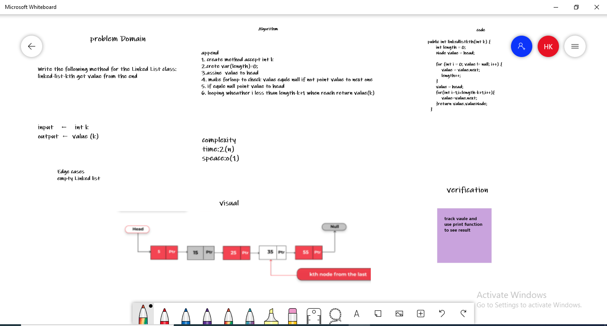

# Challenge Summary
Write the following method for the Linked List class:

1. linked-list-kth get value from the end 
aargument: a number, k, as a parameter.
Return the node’s value that is k places from the tail of the linked list.
You have access to the Node class and all the properties on the Linked List class as well as the methods created in previous challenges.

## Whiteboard Process

## Approach & Efficiency
Big O:
* time :2(n)
* speace:o(1)

## Solution
  public int linkedlistkth(int k) {
        int length = 0;
        Node value = head;

        for (int i = 0; value != null; i++) {
            value = value.next;
            length++;
        }
        value = head;
        for(int i=1;i<length-k+1;i++){
            value=value.next;
        }return value.valueNode;
    }