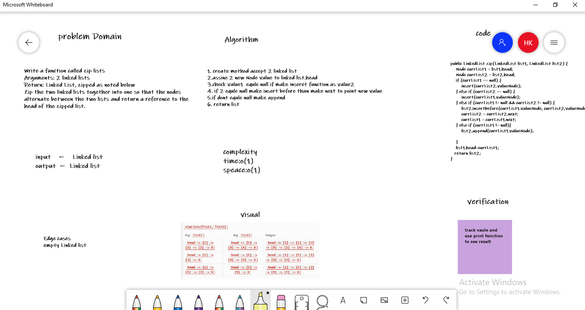

# Challenge Summary
Write the following method for the Linked List class:

1.Write a function called zip lists
Arguments: 2 linked lists
Return: Linked List, zipped as noted below

## Whiteboard Process

## Approach & Efficiency
Big O:
* time :o(1)
* speace:o(1)

## Solution
    public LinkedList zip(LinkedList list1, LinkedList list2) {
        Node currList1 = list1.head;
        Node currList2 = list2.head;
        if (currList1 == null) {
            insert(currList2.valueNode);
        } else if (currList2 == null) {
            insert(currList1.valueNode);
        } else if (currList1 != null && currList2 != null) {
            list2.insertbefore(currList1.valueNode, currList2.valueNode);
            currList2 = currList2.next;
            currList1 = currList1.next;
        } else if (currList1 != null){
            list2.append(currList1.valueNode);

        }
        list1.head=currList1;
       return list2;
    }